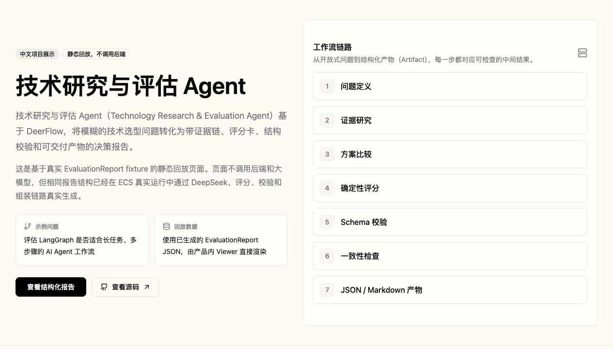

# 技术研究与评估 Agent

**Technology Research & Evaluation Agent**

基于 DeerFlow 垂直改造的技术研究与评估 Agent，用于把模糊的技术选型问题转化为带证据链、方案比较、确定性评分卡、结构校验和可交付产物的决策报告。

它与普通聊天式技术调研的区别在于：输出不是一段自由文本总结，而是一份可追溯、可校验、可由系统继续消费的 `EvaluationReport`。

快速入口：

- [在线 Demo](https://deerflow-technology-evaluation-agent.vercel.app)
- [完整 Demo 与真实部署证明](docs/demo.md)
- [查看 JSON 报告](examples/technology-evaluation/live_run/langgraph-technology-evaluation-report.json)
- [查看 Markdown 报告](examples/technology-evaluation/live_run/langgraph-technology-evaluation-report.md)
- [GitHub 仓库](https://github.com/kotarou5106/deerflow-technology-evaluation-agent)



## 项目定位

这个项目用于评估一个技术、框架、协议、模型或开源项目是否值得学习、采用或投入生产试点。它围绕“是否值得采用、在什么条件下采用、风险是什么、证据在哪里”组织研究流程。

核心输出包括：

- 可追溯证据链（Evidence Chain）
- 方案比较（Alternative Analysis）
- 确定性评分卡（Deterministic Evaluation Scorecard）
- 结构模式校验（Schema Validation）
- 一致性检查（Consistency Check）
- JSON + Markdown 双结构化产物（Artifact）
- EvaluationReport Viewer

## 在线 Demo

正式 Vercel Demo：

<https://deerflow-technology-evaluation-agent.vercel.app>

当前长期展示采用静态回放模式：

- 基于真实 `EvaluationReport` fixture；
- 不调用后端或大模型；
- 与 ECS live run 使用相同核心报告结构；
- 用于稳定、长期、低成本展示；
- 不冒充实时 Agent。

Vercel production deployment 已 Ready，正式域名根路径会重定向到中文 Demo：`/demo/technology-evaluation`。

## 完整工作流

```text
用户问题
→ Technology Evaluation Skill
→ Web Search / Evidence Gathering
→ Alternative Analysis
→ Evaluation Scorecard
→ EvaluationReport Schema Validation
→ Consistency Check
→ Evaluation Report Assembly
→ JSON Artifact / Markdown Artifact
```

这条链路已经在阿里云香港 ECS 上完成过真实 full-stack 部署和 live run。详细过程、截图和产物说明见：[查看完整 Demo 与真实部署证明](docs/demo.md)。

## 核心设计

### EvaluationReport 结构化 Schema

`EvaluationReport` 是本项目的核心报告结构。它把 verdict、scorecard、evidence、alternatives、risks、references 等内容固定为可解析字段，便于前端 Viewer、Schema 校验和后续自动化复用。

### Deterministic Scorecard

确定性评分卡（Deterministic Evaluation Scorecard）使用固定维度、权重和评分规则计算 `final_score` 与 `verdict`。这让“推荐 / 不推荐”不只依赖模型自由表达，而是有可审阅的计算过程。

### Evidence Chain

证据链（Evidence Chain）将关键 claim 与 evidence id、source title、source URL、source type、trust、confidence 等元数据绑定。审阅者可以从结论反查证据来源，而不是只看不可验证的摘要。

### Validation Gate

校验门（Validation Gate）在报告组装前执行结构模式校验（Schema Validation）。如果 `EvaluationReport` payload 缺少关键字段或结构不符合预期，blocking error 会阻止 Artifact 写出。

### Consistency Check

一致性检查（Consistency Check）用于降低报告内部矛盾，例如评分偏低但结论强烈推荐、风险与建议不匹配、证据数量不足或 source metadata 缺失。

### Artifact Assembly

产物组装（Artifact Assembly）将通过校验的同一份报告结构生成两类产物：

- [JSON 报告](examples/technology-evaluation/live_run/langgraph-technology-evaluation-report.json)：用于系统消费、Schema 校验、前端渲染和后续自动化；
- [Markdown 报告](examples/technology-evaluation/live_run/langgraph-technology-evaluation-report.md)：用于人工审阅、展示和归档。

### EvaluationReport Viewer

前端 Demo 页面会识别并渲染 `EvaluationReport`，展示 verdict summary、scorecard、evidence matrix、risk register、alternatives 和 references，而不是只显示原始 JSON。

### DeerFlow Skill / Tool / Subagent 扩展

本项目不是从零自研 agent framework，而是在 DeerFlow 的 agent harness、skills、tools、subagents、sandbox 和 artifact 基础设施上，垂直扩展出面向技术采用决策的完整工作流。

## 普通调研 Agent vs 本项目

| 维度 | 普通聊天式技术调研 | 本项目 |
| --- | --- | --- |
| 输出形式 | 自由文本总结 | 固定结构的 `EvaluationReport` |
| 证据追踪 | 证据常混在正文里 | Claim / Evidence / Conclusion 分离 |
| 评分方式 | 模型自由生成 | 确定性评分卡计算 |
| 结构校验 | 通常没有预检 | Schema Validation + Consistency Check |
| 产物形态 | 文本或临时文件 | JSON + Markdown 双 Artifact |
| 审阅方式 | 主要靠人工阅读 | 可读、可检验、可由系统消费 |

## 真实部署证明摘要

已确认的真实运行事实：

- 在阿里云香港 ECS 上完成 Docker Compose full-stack 部署；
- Gateway、Nginx、Frontend 成功启动；
- 公网 `/health` 健康检查成功；
- DeerFlow setup 与 workspace 可正常使用；
- DeepSeek 和 Web Search 调用成功；
- Evaluation Scorecard、EvaluationReport Validate、EvaluationReport Assembly 完整链路跑通；
- 生成 JSON 和 Markdown 两个真实 Artifact；
- ECS 当前已经停止，长期展示由 Vercel 静态 Demo 承担。

完整说明见：[查看完整 Demo 与真实部署证明](docs/demo.md)。

## 验证状态

已确认：

- 前端 lint 通过；
- Next.js production build 通过；
- `/demo/technology-evaluation` 静态预渲染成功；
- frontend Docker image build 通过；
- EvaluationReport 相关测试通过；
- ECS live run 成功；
- Vercel production deployment 成功；
- 正式域名根路径可重定向到中文 Demo。

这里不虚构测试数量、准确率、用户数或性能提升。验证重点是：构建链路、展示链路、报告结构和真实 Agent 运行路径。

## 本地运行

安装依赖：

```bash
make install
```

创建本地配置：

```bash
cp config.example.yaml config.yaml
```

把 secrets 放在 `.env` 或 shell 环境变量里，不要提交。

启动完整本地应用：

```bash
make dev
```

只启动 backend：

```bash
cd backend
make dev
```

## 测试

主要测试类型：

- evaluation engine tests
- scorecard tool tests
- consistency tests
- report renderer / assembly tests
- deterministic pipeline e2e
- default-skipped live smoke test

运行 deterministic tests：

```bash
cd backend
uv run pytest \
  tests/test_evaluation_engine.py \
  tests/test_evaluation_scorecard_tool.py \
  tests/test_evaluation_report_validate_tool.py \
  tests/test_evaluation_consistency.py \
  tests/test_evaluation_report_assembly.py \
  tests/test_technology_evaluation_pipeline_e2e.py
```

运行 live smoke test 的默认跳过路径：

```bash
cd backend
uv run pytest tests/test_technology_evaluation_live_e2e.py -q
```

live smoke test 默认 skip。手动启用需要设置：

```bash
TECHNOLOGY_EVALUATION_LIVE_E2E=1
```

注意：live smoke test 依赖真实模型、网络、search/fetch provider 状态和供应商响应速度，不作为默认 CI。

## DeepSeek 配置

本项目可以使用 OpenAI-compatible provider，例如 DeepSeek。

请只通过环境变量读取 API key，不要把真实 key 写进 `config.yaml`，也不要提交 `.env`。

`.env.example` 风格示例：

```bash
DEEPSEEK_API_KEY=your_deepseek_api_key
```

`config.yaml` 示例：

```yaml
models:
  - name: deepseek-v4-flash
    display_name: DeepSeek V4 Flash
    use: langchain_openai:ChatOpenAI
    model: deepseek-v4-flash
    api_key: $DEEPSEEK_API_KEY
    base_url: https://api.deepseek.com
    request_timeout: 600.0
    max_retries: 2
    max_tokens: 8192
    temperature: 0.2
    supports_thinking: false
    supports_reasoning_effort: false
    supports_vision: false
```

`config.yaml` 和 `.env` 是本地配置文件，不应提交到 GitHub。

## 限制与成本

- 深度技术研究的 token 和时间成本较高；
- 一次成功 live run 约消耗 429.6K tokens；
- 真实运行速度受搜索、证据整理、模型调用、评分、校验和组装步骤影响；
- 结果质量依赖证据来源、来源可信度和模型推理；
- 静态 Demo 不代表实时模型调用。

因此，长期展示采用 Vercel 静态回放；ECS live demo 只在需要证明端到端能力时临时启动。

## 项目结构入口

与该垂直 Agent 直接相关的核心位置：

- `skills/public/technology-evaluation/`
- `skills/public/technology-evaluation/assets/report_template.md`
- `backend/packages/harness/deerflow/evaluation/`
- `examples/technology-evaluation/`
- `frontend/src/app/demo/technology-evaluation/`
- `frontend/src/components/workspace/artifacts/evaluation-report-viewer.tsx`

## Attribution / 致谢

Built on DeerFlow.

This repository vertically extends DeerFlow for technology research and evaluation.

Original DeerFlow project provides the agent harness, skills system, tools, subagents, sandbox, and frontend artifact infrastructure.

原始项目：

- [bytedance/deer-flow](https://github.com/bytedance/deer-flow)
- [DeerFlow website](https://deerflow.tech)

## Documentation Links

- [完整 Demo 与真实部署证明](docs/demo.md)
- [Contributing Guide](CONTRIBUTING.md)
- [Security Policy](SECURITY.md)
- [Code of Conduct](CODE_OF_CONDUCT.md)
- [Backend Architecture](backend/README.md)
- [Configuration Guide](backend/docs/CONFIGURATION.md)

## License

This project follows the original repository license. See [LICENSE](LICENSE).

## Security

不要提交 `.env`、`config.yaml`、API keys、provider tokens，或包含 secrets 的 live run logs。更多安全说明见 [SECURITY.md](SECURITY.md)。
